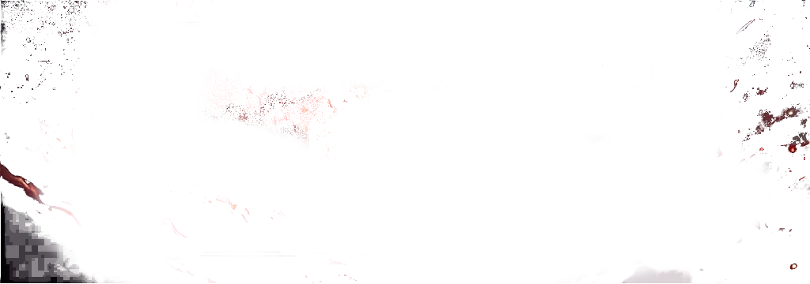
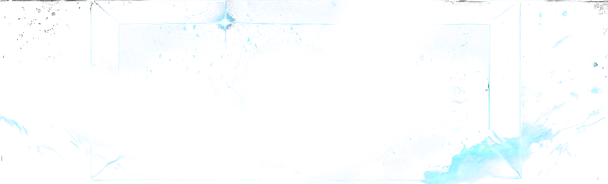
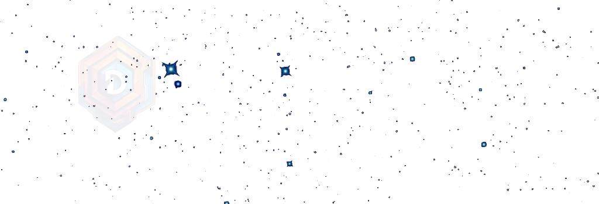

https://github.com/user-attachments/assets/c7b1e3ad-7f79-4cb0-9b5c-7cd43473cb2c

# Parallax Starry Sky

A responsive parallax scrolling effect with a starry sky background, including interactive elements and zoom controls. This project is ideal for demonstrating parallax effects and interactive UI components.

## Features

- **Parallax Scrolling**: Multi-layered background that moves at different speeds to create a depth effect.
- **Interactive Elements**: Clickable points that display information in a card.
- **Zoom Controls**: Buttons to zoom in and out of the view.
- **Position Controls**: Sliders to move horizontally and vertically.

## Demo

Check out the live demo on [CodePen](https://codepen.io/ogerly/pen/yLdNvWv).

## Installation

1. Clone the repository:
    ```sh
    git clone https://github.com/yourusername/parallax-starry-sky.git
    cd parallax-starry-sky
    ```

2. Open `index.html` in your browser.

## Usage

### HTML Structure

```html
<!DOCTYPE html>
<html lang="de">
<head>
    <meta charset="UTF-8">
    <meta name="viewport" content="width=device-width, initial-scale=1.0">
    <title>Parallax Sternenhimmel</title>
    <link rel="stylesheet" href="styles.css">
    <link rel="stylesheet" href="controls.css">
</head>
<body>
    <div class="scroll-container" id="scroll-container">
        <div class="parallax-layer" id="layer1">
            
        </div>
        <div class="parallax-layer" id="layer2">
            
        </div>
        <div class="parallax-layer" id="layer3">
            
        </div>
        <div class="interactive-layer" id="interactive-layer">
            <!-- Template Card -->
            <div class="card" id="template-card" style="display: none;">
                <div class="card-content"></div>
            </div>
        </div>
    </div>
    <div class="controls" id="controls">
        <div class="position-info" id="position-info"></div>
        <div class="control-sliders">
            <input type="range" id="horizontal-slider" min="-50" max="50" step="1" value="0">
            <input type="range" id="vertical-slider" min="-50" max="50" step="1" value="0" orient="vertical">
            <div class="zoom-control">
                <button class="zoom-button" data-zoom="0.5">--</button>
                <button class="zoom-button" data-zoom="0.8">-</button>
                <button class="zoom-button" data-zoom="1">o</button>
                <button class="zoom-button" data-zoom="1.3">+</button>
                <button class="zoom-button" data-zoom="1.6">++</button>
            </div>
        </div>
    </div>
    <script src="script.js"></script>
    <script src="controls.js"></script>
</body>
</html>
```
### Technical Explanation of the Parallax Starry Sky Project

#### Overview

The **Parallax Starry Sky Project** is a web application that demonstrates the use of parallax scrolling to create a visually engaging experience. It features multiple layers moving at different speeds to create a sense of depth, interactive elements represented by clickable points that open cards with information, and controls for navigation and zooming. 

#### Layers and Parallax Effect

The project uses three background layers, each moving at different speeds to create the parallax effect. This effect is achieved by adjusting the transformation properties of each layer in response to user input.

1. **Layer 1 (Farthest Background)**:
   - **Image**: `star_bg3.png`
   - **Transformation**: `translate(${translateX * 0.5}px, ${translateY * 0.5}px) scale(${scale})`
   - **Speed**: Slowest
   - **Depth**: Appears farthest away

2. **Layer 2 (Middle Background)**:
   - **Image**: `star_bg2.png`
   - **Transformation**: `translate(${translateX * 0.3}px, ${translateY * 0.3}px) scale(${scale})`
   - **Speed**: Medium
   - **Depth**: Intermediate

3. **Layer 3 (Closest Background)**:
   - **Image**: `star_bg1.png`
   - **Transformation**: `translate(${translateX * 0.1}px, ${translateY * 0.1}px) scale(${scale})`
   - **Speed**: Fastest
   - **Depth**: Appears closest

#### Interactive Elements

The project includes 70 clickable points distributed randomly across the interactive layer. Each point represents a chat room and displays a card with more information when clicked.

- **Point Creation**:
  - Randomly positioned within the interactive layer.
  - Size: 70px diameter.
  - Styles: Slight transparency and pulsing animation for every 5th point.

- **Card Display**:
  - Each point opens a card displaying the chat room's title and description.
  - Card position matches the point's position.

#### Navigation Controls

The project includes three types of navigation controls for user interaction:

1. **Horizontal Slider**:
   - Adjusts the horizontal position of the layers.
   - Range: -50 to 50 (scaled by a factor of 2).

2. **Vertical Slider**:
   - Adjusts the vertical position of the layers.
   - Range: -50 to 50 (scaled by a factor of 2).

3. **Zoom Controls**:
   - Buttons for different zoom levels (`0.5`, `0.8`, `1`, `1.3`, `1.6`).
   - Changes the scale of all layers.

#### Implementation Details

**HTML Structure**:
- Contains the layers, interactive elements, and control elements.
- Utilizes `div` elements for layers and controls, and `img` elements for background images.

**CSS Styles**:
- Styles for the body, layers, points, and controls.
- Keyframes for the pulsing animation of points.

**JavaScript Functionality**:
- Handles user input for dragging, touch movement, and wheel zooming.
- Updates transformations for parallax scrolling and zooming.
- Manages the display of cards when points are clicked.

### Story for Developers

The **Parallax Starry Sky Project** starts with setting up a multi-layered background using images of a starry sky. Each layer is given a different transformation speed to create the illusion of depth as the user navigates horizontally and vertically. Clickable points are then added to the interactive layer, each representing a chat room with detailed information displayed in a card upon interaction. 

Navigation is facilitated through sliders for horizontal and vertical movement and buttons for zoom control, allowing users to explore the parallax environment intuitively. The project demonstrates the seamless integration of CSS, HTML, and JavaScript to create an interactive and visually appealing web application.

### Links to Resources

- **GitHub Repository**: [Parallax Starry Sky](https://github.com/ogerly/parallax-starry-sky)
- **Live Demo on CodePen**: [Parallax Starry Sky Demo](https://codepen.io/ogerly/pen/yLdNvWv)

This explanation provides a comprehensive understanding of the technical aspects and the implementation of the Parallax Starry Sky Project, making it easier for developers to comprehend and build upon.
